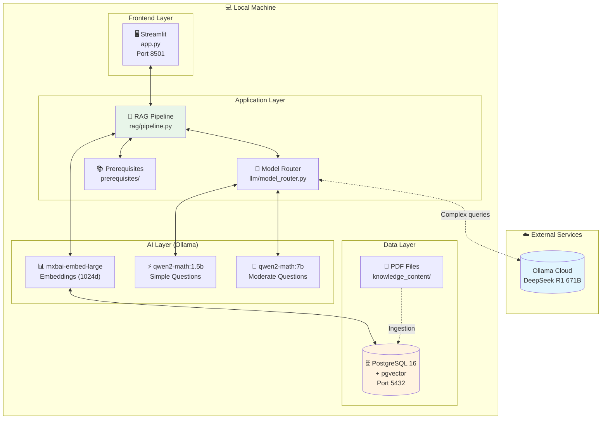
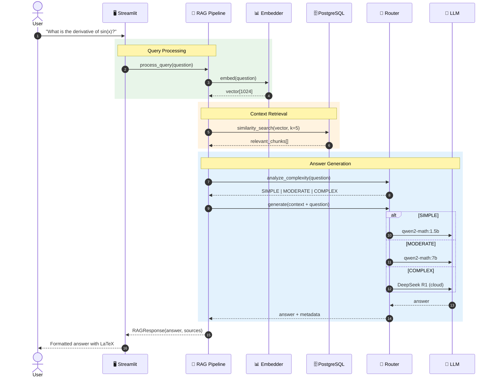
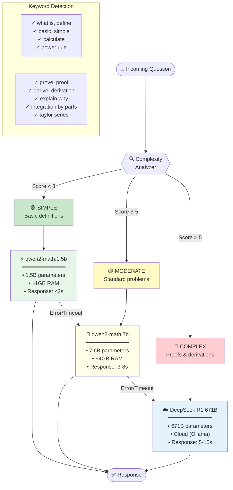
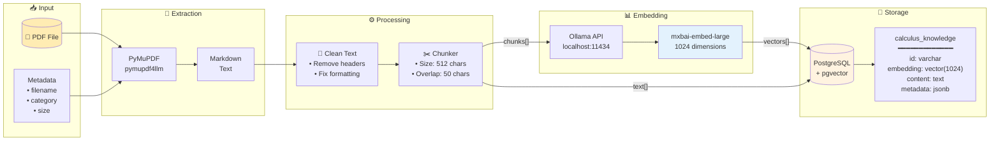
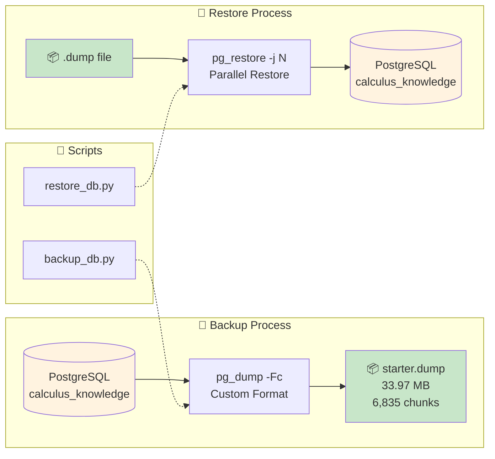
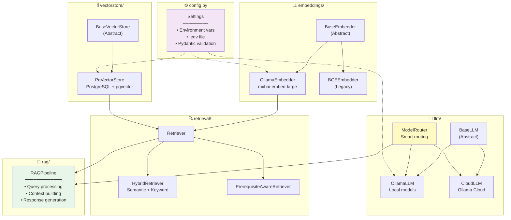
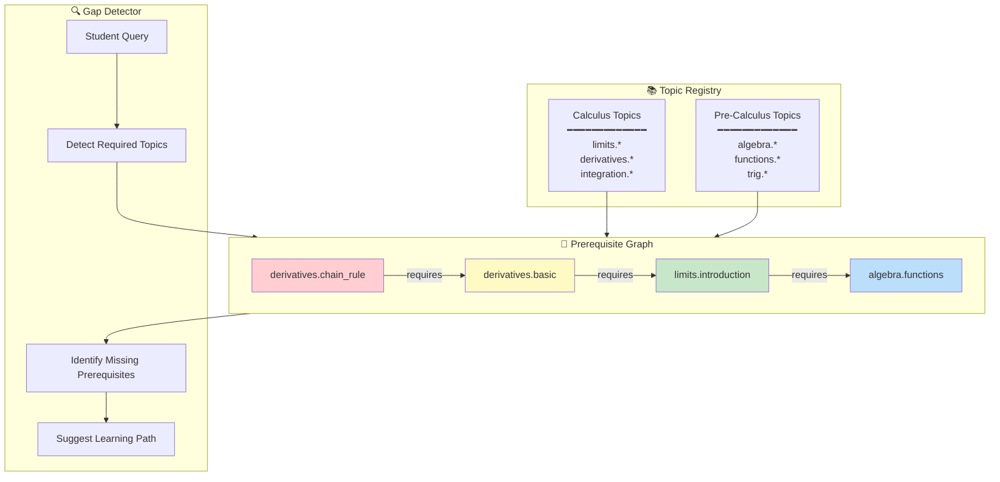
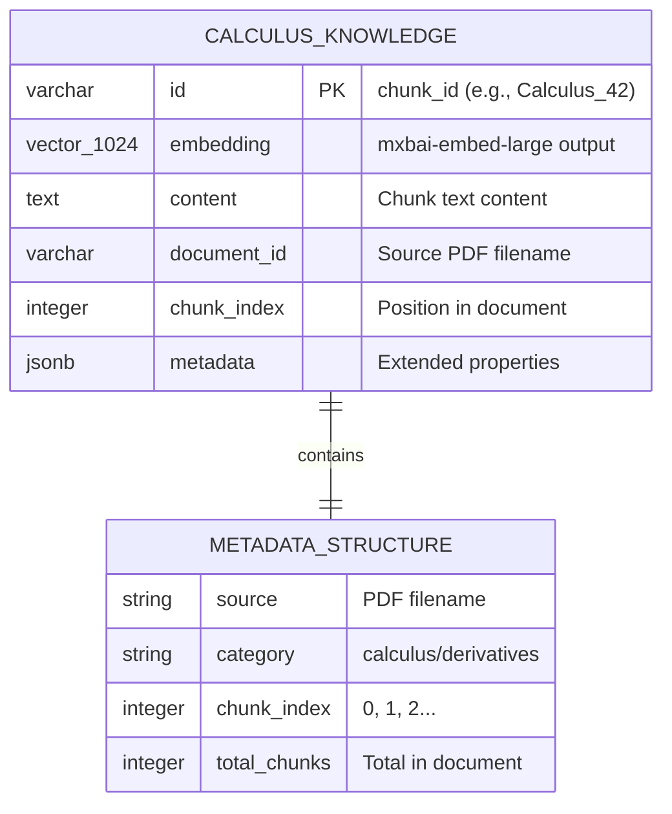
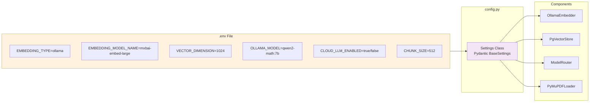

# Calculus RAG - System Architecture

A comprehensive visual guide to the system architecture.

---

## 1. System Overview



---

## 2. Request Flow (Question → Answer)



---

## 3. Model Routing Decision Tree



---

## 4. Data Ingestion Pipeline



---

## 5. Backup & Restore



**Quick Start Options:**
| Method | Command | Time |
|--------|---------|------|
| Restore pre-built | `python scripts/restore_db.py backups/starter.dump` | ~30 seconds |
| Full ingestion | `python scripts/ingest_pdfs.py` | 5-15 minutes |
| Add single PDF | `python scripts/add_pdf.py path/to/file.pdf` | 1-2 minutes |

---

## 6. Component Architecture



---

## 7. Prerequisite System



---

## 8. Database Schema



---

## 9. Environment Configuration



---

## 10. Directory Structure

```
📁 Calculus_RAG/
│
├── 📄 app.py                    # Streamlit entry point
├── 📄 .env                      # Configuration (from .env.example)
├── 📄 docker-compose.yml        # PostgreSQL setup
│
├── 📁 scripts/
│   ├── 📄 ingest_pdfs.py        # Full ingestion (clears DB)
│   ├── 📄 add_pdf.py            # Add single PDF (preserves DB)
│   ├── 📄 ingest_markdown.py    # Ingest markdown files
│   ├── 📄 backup_db.py          # Create database backup
│   ├── 📄 restore_db.py         # Restore from backup
│   ├── 📄 check_ingestion.py    # View DB status
│   └── 📄 interactive_rag.py    # Terminal chat
│
├── 📁 backups/
│   └── 📄 starter.dump          # Pre-built knowledge base (6,835 chunks)
│
├── 📁 src/calculus_rag/
│   ├── 📄 config.py             # Settings management
│   │
│   ├── 📁 embeddings/           # Text → Vector
│   │   ├── 📄 base.py           # Abstract interface
│   │   └── 📄 ollama_embedder.py
│   │
│   ├── 📁 vectorstore/          # Vector storage
│   │   ├── 📄 base.py           # Abstract interface
│   │   └── 📄 pgvector_store.py
│   │
│   ├── 📁 llm/                  # Language models
│   │   ├── 📄 base.py           # Abstract interface
│   │   ├── 📄 ollama_llm.py     # Local models
│   │   ├── 📄 cloud_llm.py      # Cloud models
│   │   └── 📄 model_router.py   # Smart routing
│   │
│   ├── 📁 loaders/              # PDF processing
│   │   └── 📄 pymupdf_loader.py
│   │
│   ├── 📁 retrieval/            # Search
│   │   ├── 📄 retriever.py
│   │   └── 📄 hybrid_retriever.py
│   │
│   ├── 📁 rag/                  # Orchestration
│   │   └── 📄 pipeline.py
│   │
│   └── 📁 prerequisites/        # Topic dependencies
│       ├── 📄 topics.py
│       ├── 📄 graph.py
│       └── 📄 detector.py
│
├── 📁 knowledge_content/        # Source content
│   ├── 📁 calculus/             # Calculus PDFs
│   ├── 📁 pre_calculus/         # Pre-calculus PDFs
│   ├── 📁 guides/               # Study guides
│   ├── 📁 reference/            # Reference materials
│   └── 📁 khan_academy/         # Khan Academy summaries (44 markdown files)
│
└── 📁 tests/                    # Test suite
```

---

## 11. Technology Stack

| Layer | Technology | Version | Purpose |
|-------|------------|---------|---------|
| **Frontend** | Streamlit | 1.30+ | Web UI with LaTeX |
| **Backend** | Python | 3.10+ | Core application |
| **Database** | PostgreSQL | 16 | Document storage |
| **Vector Search** | pgvector | 0.5+ | Similarity search |
| **Local AI** | Ollama | 0.1+ | Model serving |
| **Embeddings** | mxbai-embed-large | 334M | Text → 1024d vectors |
| **Local LLM** | Qwen2-Math | 1.5B/7B | Math responses |
| **Cloud LLM** | DeepSeek R1 | 671B | Complex proofs |
| **PDF Processing** | pymupdf4llm | 1.0+ | Text extraction |
| **Config** | Pydantic | 2.0+ | Settings validation |
| **Package Manager** | uv | Latest | Fast installs |
